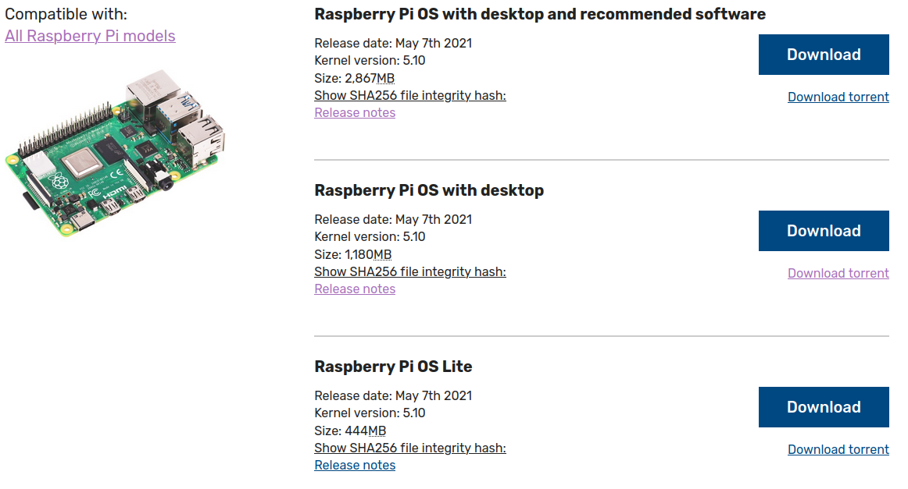

# Installing Raspberry Pi OS

- Date: 07/19/2021
  
Computer OS used to install Rapsberry Pi OS: Ubuntu 20.04.2 LTS (x64 bits)

Version to install:

- Release date: May 7th 2021
- Kernel version: 5.10
- More documentation available on: [Raspberry Pi page](https://www.raspberrypi.org/)

## Previous considerations

### Raspberry Pi

The laboratory has a [Raspberry Pi model B](https://www.raspberrypi.org/products/raspberry-pi-3-model-b/), which has the following characteristics:

- Quad Core 1.2 GHz Broadcom BCM2837 64 bit CPU
- 1 GB RAM
- BCM43438 wireless LAN and Bluetooth Low Energy (BLE) ob board
- 100 Base Ethernet
- 40-pin extended GPIO
- 4 USB 2 ports
- 4 Pole stereo output and compsite video port
- Full size HDMI
- CSI camera port for connecting a Raspberry Pi camera
- DSI display port for connecting a Raspberry Pi touchscreen display
- Micro SD por for loading your operative system ad storing data
- Upgraded switched Micro USB power source up to 2.5 A

Although this is the board used in the laboratory, a more recent version of the Raspberry Pi can be used instead.

#### Raspberry Pi - power supply

Available on: [Getting started guide](https://projects.raspberrypi.org/en/projects/raspberry-pi-setting-up/1).

To connect a power socket, all Raspberry Pi models hace a USB port (the same found on many phones): either USB-C for Raspberry Pi 4, or micro USB for Raspberry Pi 3, 2, and 1.

You need a power supply that provides:

- At least 3.0 A for Raspberry Pi 4
- At least 2.5 A for Raspberry Pi 3

The laboratory has:

- Manufacturer: CheTech
- Model: CT0530LU
- INPUT: 110-240 V ~ 50/60 Hz 0.5 A Max
- OUTPUT: 5 V 3.0 A
- Type connector: US 2-pin

### SD card

Raspberry Pi recommend using a SD card of 8 GB or greater capacity (see [SD cards](https://www.raspberrypi.org/documentation/installation/sd-cards.md)).

The laboratory has:

- Manufacturer: Sandisk
- Model: Ultra
- Class: 10 (minimun write capacity 10 MB/s)
- Storage type: HC I (capacity up to 32 GB)
- Capacity: 16 GB

## Hardware available

- 1 Rasberry Pi Model B
- 1 power supply: 5 V / 3 A
- 1 SD card: 16 GB

## Step 1 - Download Raspberry Pi OS
Go to: [Operative System Images](https://www.raspberrypi.org/software/operating-systems/) to download Raspberry Pi OS image. It is recommended to download the option #2: *Raspberry Pi OS with desktop*.

Choose **Download** or **Download Torrent** according to your favorite option.

## Step 2 - 

## Troubleshooting

### SD Troubleshooting

This considerations are availabe on: [SD cards](https://www.raspberrypi.org/documentation/installation/sd-cards.md)

If you are having problems with your SD card:

1. Make sure you are using a genuine SD card. The best way to avoid fake SD cards is to always buy from a reputable supplier.
2. Make sure you are using a good quality power supply: we recommend using an official Raspberry Pi power supply.
3. The cable for the power supply unit to the Raspberry Pi can also cause problems. This is usually due to the resistance of the wires in the USB power cable; to save money, USB cables have as little copper in them as possible, which causes a voltage drop across the cable.
4. Make sure you shut down the operating system correctly before you power down the Raspberry Pi.