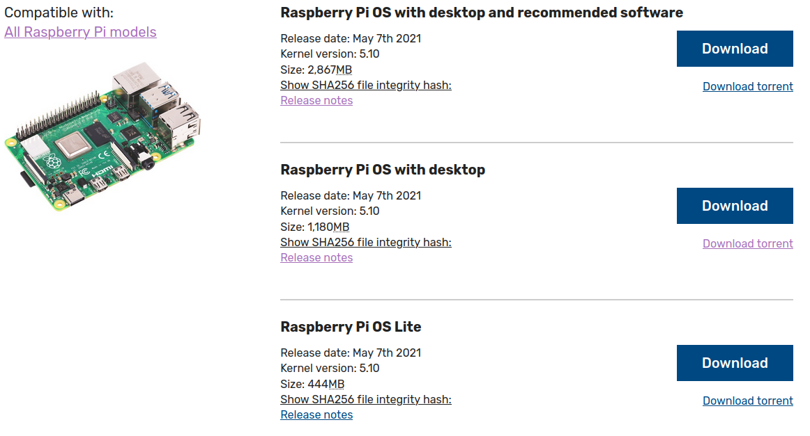
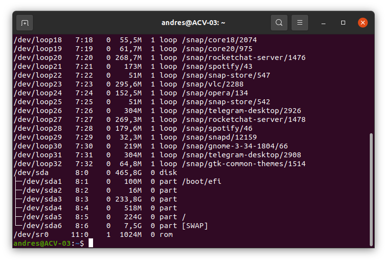
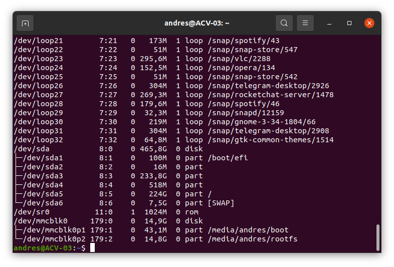
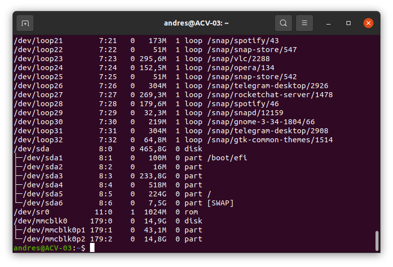
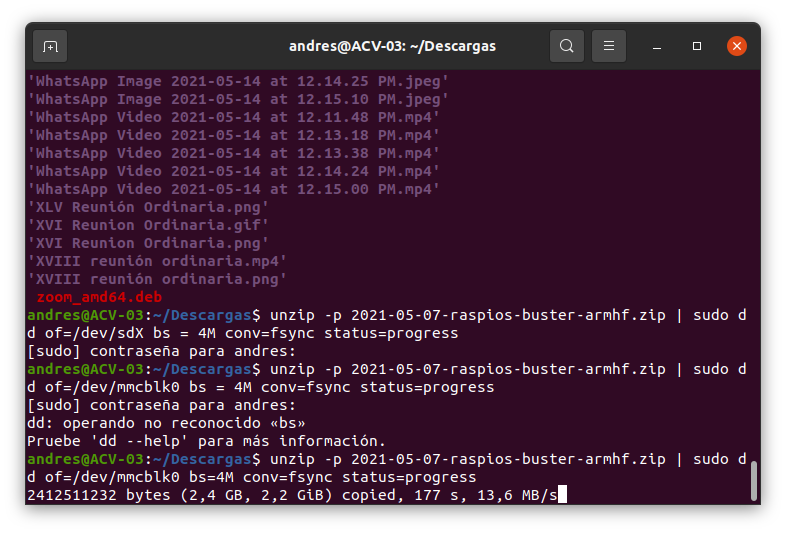
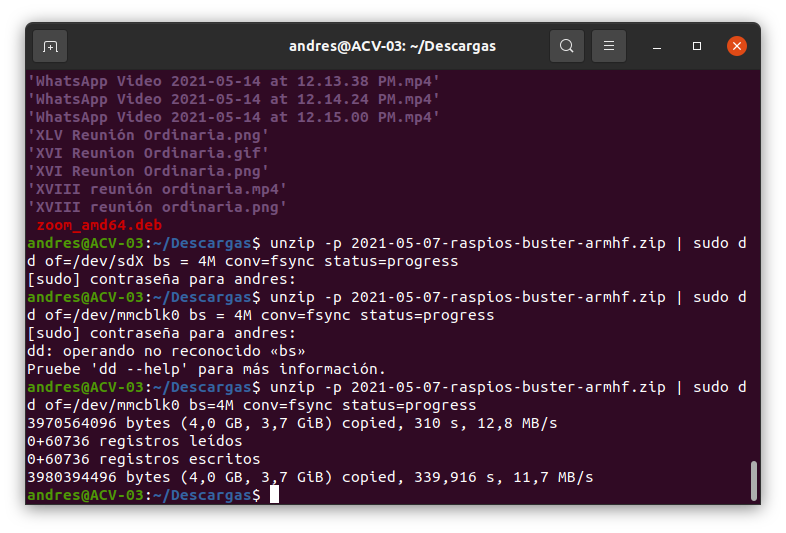
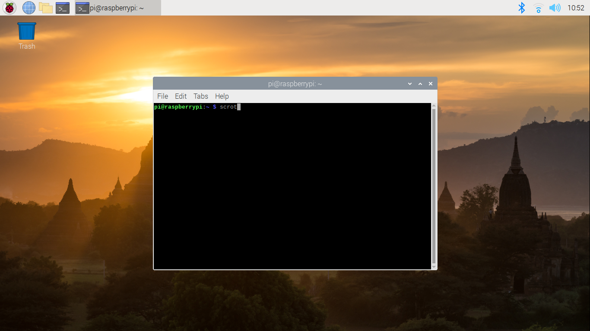

# Installing Raspberry Pi OS

- Date: 07/19/2021
  
Computer OS used to install Rapsberry Pi OS: Ubuntu 20.04.2 LTS (x64 bits)

Version to install:

- Release date: May 7th 2021
- Kernel version: 5.10
- More documentation available on: [Raspberry Pi page](https://www.raspberrypi.org/)


## 1. Previous considerations

### Raspberry Pi

The laboratory has a [Raspberry Pi model B](https://www.raspberrypi.org/products/raspberry-pi-3-model-b/), which has the following characteristics:

- Quad Core 1.2 GHz Broadcom BCM2837 64 bit CPU
- 1 GB RAM
- BCM43438 wireless LAN and Bluetooth Low Energy (BLE) ob board
- 100 Base Ethernet
- 40-pin extended GPIO
- 4 USB 2 ports
- 4 Pole stereo output and compsite video port
- Full size HDMI
- CSI camera port for connecting a Raspberry Pi camera
- DSI display port for connecting a Raspberry Pi touchscreen display
- Micro SD por for loading your operative system ad storing data
- Upgraded switched Micro USB power source up to 2.5 A

Although this is the board used in the laboratory, a more recent version of the Raspberry Pi can be used instead.

### Raspberry Pi - power supply

Available on: [Getting started guide](https://projects.raspberrypi.org/en/projects/raspberry-pi-setting-up/1).

To connect a power socket, all Raspberry Pi models hace a USB port (the same found on many phones): either USB-C for Raspberry Pi 4, or micro USB for Raspberry Pi 3, 2, and 1.

You need a power supply that provides:

- At least 3.0 A for Raspberry Pi 4
- At least 2.5 A for Raspberry Pi 3

The laboratory has:

- Manufacturer: CheTech
- Model: CT0530LU
- INPUT: 110-240 V ~ 50/60 Hz 0.5 A Max
- OUTPUT: 5 V 3.0 A
- Type connector: US 2-pin

### SD card

Raspberry Pi recommend using a SD card of 8 GB or greater capacity (see [SD cards](https://www.raspberrypi.org/documentation/installation/sd-cards.md)).

The laboratory has:

- Manufacturer: Sandisk
- Model: Ultra
- Class: 10 (minimun write capacity 10 MB/s)
- Storage type: HC I (capacity up to 32 GB)
- Capacity: 16 GB


## 2. Hardware available

- 1 Rasberry Pi Model B
- 1 power supply: 5 V / 3 A
- 1 SD card: 16 GB


## 3. Step by step

More info: [Standard installation](https://www.raspberrypi.org/documentation/installation/).

## Step 1 - Download Raspberry Pi OS
Go to: [Operative System Images](https://www.raspberrypi.org/software/operating-systems/) to download Raspberry Pi OS image. It is recommended to download the option #2: *Raspberry Pi OS with desktop*.



Choose **Download** or **Download Torrent** according to your favorite option.

## Step 2 - Installing OS images

More info: [Installing Operative System images on Linux](https://www.raspberrypi.org/documentation/installation/installing-images/linux.md).

### Discovering the SD card mountpoint and unmounting it.
- Run `lsblk -p` to see which devices are currently connected to your machine.

```bash
$ lsblk -p
```



- If your computer has a slot for SD cards, insert the card. If not, insert the card into an SD reader, then connect the reader to your computer.
- Run `lsblk -p` again. The new device that has appeared is your SD card (you can also usually tell from the listed device size). The naming of the device will follow the format described in the next paragraph.
- The left column of the results from the `lsblk -p` command gives the device name of your SD card and the names of any partitions on it (usually only one, but there may be several if the cards was previously used). It will be listed as something like `/dev/mmcblk0` or `/dev/sdX` (with partition names `/dev/mmcblk0p1` or `/dev/sdX1` respectively), where `X` is a lower-case letter indicating the device (eg. `/dev/sdb1`). The right column shows where the partitions have been mounted (if they haven't been, it will be blank).

```bash
$ lsblk -p
```



In this case, the name is: `/dev/mmcblk0`.

- If any partitions on the SD card have been mounted, unmount them all with `umount`, for example `umount /dev/sdX1` (replace `sdX1` with your SD card's device name, and change the number for any other partitions).

```bash
umount /dev/mmcblk0p1 && umount /dev/mmcblk0p2
```



### Copying the image to the SD card

In Linux it is possible to commbine the unzip and SD copying process into one command, which avoids any issues that might occur when the unzipped image is larger than 4 GB. This can happen on certain filesystems that do not support files larger than 4 GB (e.g. FAT), although it shlould be noted that most Linux installations do not use FAT and therefore do not have this limitation.

The following command unzips the zip file (replace **2021-05-07-raspios-buster-armhff.zip** with the appropiate zip filename), and pipes the output directly to the `dd` comand. This in turn copies it to the SD card.

```bash
unzip -p 2021-05-07-raspios-buster-armhff.zip | sudo dd of=/dev/mmcblk0 bs=4M conv=fsync status=progress
```





### (optional): checking whether the image was correctly written to the SD card]

See: [Installing Operative System images on Linux](https://www.raspberrypi.org/documentation/installation/installing-images/linux.md).

## Step 3 - Run Raspberry Pi OS

- Unmount the SD card.
- Connect SD card into Raspberry Pi.
- Connect HDMI screen, keyboard, mouse and power supply.

Once the Raspberry Pi is turned on for the first time, it will request initial settings and after that, it will download updates.

1. Set current country and language: **Colombia** and **Set english language**
2. Change password: **bio2023**
3. Set up your screen: if you don't see any problem with the resolution, you can continue with the next step
4. Select WiFi Network: Network: **univalle**, Password: **Univalle** (note the capital 'U').
5. Update software: this takes a few minutes and after this the system will reboot.



## 4. Troubleshooting

### SD Troubleshooting

This considerations are availabe on: [SD cards](https://www.raspberrypi.org/documentation/installation/sd-cards.md)

If you are having problems with your SD card:

1. Make sure you are using a genuine SD card. The best way to avoid fake SD cards is to always buy from a reputable supplier.
2. Make sure you are using a good quality power supply: we recommend using an official Raspberry Pi power supply.
3. The cable for the power supply unit to the Raspberry Pi can also cause problems. This is usually due to the resistance of the wires in the USB power cable; to save money, USB cables have as little copper in them as possible, which causes a voltage drop across the cable.
4. Make sure you shut down the operating system correctly before you power down the Raspberry Pi.

### Run Raspberry Pi OS

- It is possible that the operating system takes several seconds to start, this may be because you are configuring the hardware for the first time, it may also occur that it restarts a couple of times.

- If after a few minutes the system does not boot, try disconnecting the power, disconnect the SD card and connect again.

- If the problem persists, try the [optional step](#optional-checking-whether-the-image-was-correctly-written-to-the-sd-card) and verify that the Raspberry Pi OS image was copied correctly.

