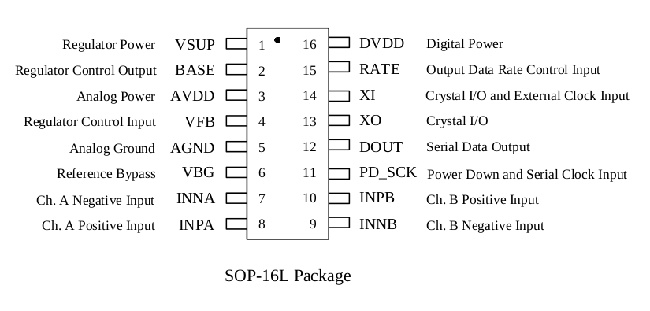

HX711:
24-Bit Analog-to-Digital Converter (ADC) for Weigh Scales
===
Datasheet available on: [HX711 Datasheet](https://www.mouser.com/datasheet/2/813/hx711_english-1022875.pdf)

Pin Description
---

| PIN # | NAME   | FUNCTION       |                               DESCRIPTION                                |
| ----- | ------ | -------------- | :----------------------------------------------------------------------: |
| 1     | VSUP   | Power          |                      Regulator supply: 2.7 ~ 5.5 V                       |
| 2     | BASE   | Analog Output  |               Regulator control output (NC when not used)                |
| 3     | AVDD   | Power          |                       Analog supply: 2.6  ~ 5.5 V                        |
| 4     | VFB    | Analog Input   |         Regulator control input (connect to AGND when not used)          |
| 5     | AGND   | Ground         |                              Analog ground                               |
| 6     | VBG    | Analog Output  |                         Reference bypass output                          |
| 7     | INA-   | Analog Input   |                         Channel A negative input                         |
| 8     | INA+   | Analog Input   |                         Channel A positive input                         |
| 9     | INB-   | Analog Input   |                         Channel B negative input                         |
| 10    | INB+   | Analog Input   |                         Channel B positive input                         |
| 11    | PD_SCK | Digital Input  | Power down control (high active) and serial clock and serial clock input |
| 12    | DOUT   | Digital Output |                            Serial data output                            |
| 13    | XO     | Digital I/O    |                      Crystal I/O (NC when not used)                      |
| 14    | XI     | Digital Input  |      Crystal I/O or external clock input, 0: use on-chip oscillator      |
| 15    | RATE   | Digital Input  |               Output data rate control, 0: 10 Hz; 1: 80 Hz               |
| 16    | DVDD   | Power          |                       Digital supply: 2.6 ~ 5.5 V                        |

Analog Inputs
---

### Channel A
It can be programmed with a gain of 128 or 64. When 5V supply is used at the AVDD pin, these gains correspond to a full-scale differential input voltage of &plusmn; 20 mV or &plusmn; 40 mV respectively.

**(For 3.3 AVDD the range is near to &plusmn; 13 mV and &plusmn; 26 mV respectively).**

### Channel B
It has a fixed gain of 32. The full-scale input voltage range is &plusmn; 80 mV, when 5V suppl is used at the AVV pin.

**(For 3.3 AVDD the range is near to &plusmn; 52 mV).**

Power Supply Options
---
DVDD should be the same power supply as the MCU power supply.

If the on-chip analog supply regulator is not used, the VSUP pin should be connected to either AVDD or DVDD. depending on which voltage is higher. Pin VFB should be connected to Ground and pin BASE becomes NC. The external 0.1 &micro;F bypass capacitor at the VBG output pin is then not needed.

**(VSUP is connect to DVDD, VFB to ground, VGB and BASE is NC).**

Clock Source Options
---
By connecting pin XI to Ground,, the on-chip oscillator is actived. The nominal output data rate when using the internal oscillator is 10 (RATE=0) or 80 SPS (RATE=1).

Output Data Rate and Format
---
The output 24 bits of data is in 2's complement format. When input differential signal goes out of 24 bit range, the output data will be saturated at 800000h (MIN) or 7FFFFFh (MAX), until the input signal comes back to the input range.

Serial Interface
---
Pin PD_SCK and DOUT are used or data retreival, input selection, gain selection and power down controls.

When output data is not ready for retrieval, digital output pin DOUT is high. Serial clock input PD_SCK should be low. When DOUT goes to low, it indicates data is ready for retrieval. By applying 25~27 positive clock pulses at the PD_SCK pin, data is shifted out from the DOUT output pin. Each PD_SCK pulse shiffts out one bit, starting with the MSB bit first, until all 24 bits are shifted out. The 25th pulse at PD_SCK input will DOUT pin back tto high.

Input and gain selection is controlled by the
number of the input PD_SCK pulses (Table 3).
PD_SCK clock pulses should not be less than 25
or more than 27 within one conversion period, to
avoid causing serial communication error.

| PD_SCK Pulses | Input channel | Gain |
| ------------- | ------------- | ---- |
| 25            | A             | 128  |
| 26            | B             | 32   |
| 27            | A             | 64   |

| Symbol        |                  Note                   | MIN | TYP | MAX | Unit     |
| ------------- | :-------------------------------------: | --- | --- | --- | -------- |
| T1 | DOUT falling edge to PD_SCK rising edge | 0.1 |     |     | &micro;s |
| T2 |  PD_SCK rising edge to DOUT data ready  |     |     | 0.1 | &micro;s |
| T3 |            PD_SCK high time             | 0.2 | 1   | 50  | &micro;s |
| T4 |             PD_SCK low time             | 0.2 | 1   |     | &micro;s |

When chip is powered up, on-chip power on rest circuitry will reset the chip.

Pin PD_SCK input is used to power down the HX711. When PD_SCK Input is low, chip is in normal working mode.

When PD_SCK pin changes fromm low to high and stays at high for longer than 60 &micro;s, HX711 enters power down mode. When internal regulator is used for HX711 and the external transducer, both HX711 and the transducer will be power down. When PD_SCK returns to low, chip will reset and enter normal operation mode.

After a reset or power-down event, input selection is default to Channel A with gain of 128.